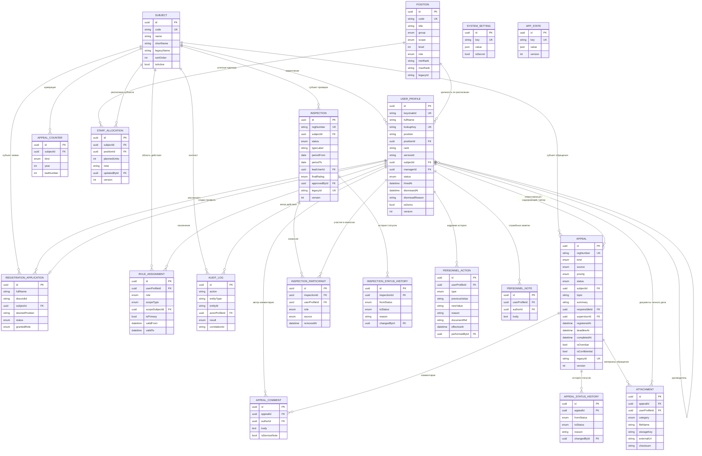
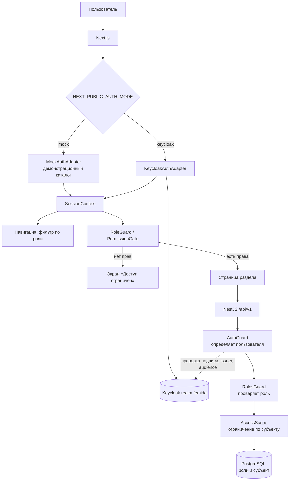
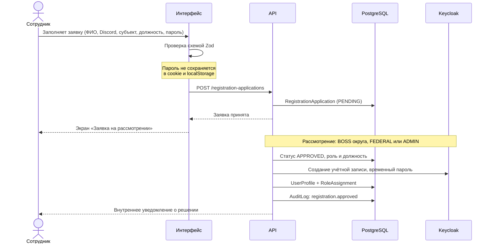
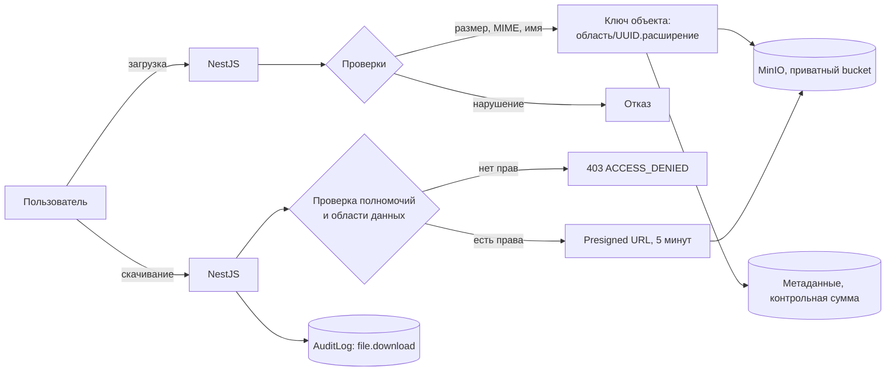
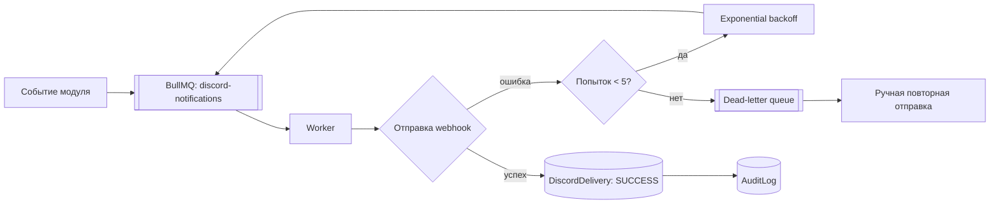

# ЕИАС «Фемида»

Внутренняя единая информационно-аналитическая система игровой прокуратуры
GTA RMRP-проекта.

> **ЕИАС «Фемида» является игровой информационной системой и используется
> исключительно в рамках GTA RMRP-проекта.**
>
> Система не является государственной информационной системой, не связана с
> государственными органами и не использует государственную символику.

---

## Содержание

- [Текущее состояние](#текущее-состояние)
- [Архитектура](#архитектура)
- [Структура репозитория](#структура-репозитория)
- [Требования](#требования)
- [Быстрый запуск](#быстрый-запуск)
- [Тестовое размещение на хосте](docs/test-hosting.md)
- [Запуск для разработки](#запуск-для-разработки)
- [Переменные окружения](#переменные-окружения)
- [Модель прав](#модель-прав)
- [Диаграммы](#диаграммы)
- [Настройка Keycloak](#настройка-keycloak)
- [Настройка MinIO](#настройка-minio)
- [Настройка Discord webhook](#настройка-discord-webhook)
- [Миграции и seed](#миграции-и-seed)
- [Тестирование](#тестирование)
- [Действующая (легаси) база данных](#действующая-легаси-база-данных)
- [Troubleshooting](#troubleshooting)
- [Правила production deployment](#правила-production-deployment)

---

## Текущее состояние

Реализованы инфраструктура, дизайн-система, маршруты, демонстрационная
авторизация и пять рабочих модулей — **«Обращения и жалобы»**, **«Личные
дела»**, **«Штат»**, **«Премии»** и **«Проверки»**. Остальные модули
(аттестации, командировки, аналитика, календарь) существуют как маршруты с
заглушкой `ModulePlaceholder`, где указаны перечень запланированных
возможностей и этап реализации.

Что работает по-настоящему:

| Возможность                                                                  | Состояние          |
| ---------------------------------------------------------------------------- | ------------------ |
| Запуск всей системы через `docker compose up -d`                             | ✅                 |
| Дизайн-система, боковая навигация, палитра команд, breadcrumbs               | ✅                 |
| Все маршруты открываются, динамические в том числе                           | ✅                 |
| Демонстрационная авторизация с сохранением сессии между перезагрузками       | ✅                 |
| Скрытие разделов по роли + экран «Доступ ограничен»                          | ✅                 |
| **Модуль «Обращения и жалобы»: реестр, регистрация, карточка, сроки**        | ✅                 |
| **Материалы обращений: загрузка файлов в MinIO и ссылки**                    | ✅                 |
| **Подведомственность и обжалование отказа**                                  | ✅                 |
| **Импорт 691 обращения из действующей системы**                              | ✅                 |
| **Модуль «Личные дела»: реестр, карточка, кадровая история**                 | ✅                 |
| **Импорт 207 личных дел сотрудников из действующей системы**                 | ✅                 |
| **Модуль «Штат»: расписание, вакансии, структура, справочник должностей**    | ✅                 |
| **Модуль «Премии»: реестр, правило выплаты за счёт округа, отчёт о выплате** | ✅                 |
| **Модуль «Проверки»: реестр, жизненный цикл, комиссия**                      | ✅                 |
| **Импорт 12 надзорных проверок из действующей системы**                      | ✅                 |
| `GET /api/v1/health`, `/system/status`, `/subjects`, `/me`, `/employees`     | ✅                 |
| Журнал аудита значимых действий                                              | ✅                 |
| Проверка токенов Keycloak на стороне API (при `AUTH_MODE=keycloak`)          | ✅                 |
| PostgreSQL + Prisma, Redis, MinIO, BullMQ                                    | ✅                 |
| Swagger в режиме разработки                                                  | ✅                 |
| Модуль «КадрПРО»                                                             | ❌ не создаётся    |
| Рабочие операции модулей аттестаций, командировок, аналитики и т. д.         | ❌ следующие этапы |

### Модуль «Обращения и жалобы»

| Возможность                                                   | Где                                        |
| ------------------------------------------------------------- | ------------------------------------------ |
| Реестр с серверной пагинацией, сортировкой и фильтрами        | `GET /api/v1/appeals`                      |
| Сводка: всего, в работе, просрочено, срок подходит, завершено | там же, поле `summary`                     |
| Регистрация с автоматическим номером `ОБР-КФО-2026-000001`    | `POST /api/v1/appeals`                     |
| Карточка с полным текстом, участниками и историей             | `GET /api/v1/appeals/:id`                  |
| Смена статуса по схеме переходов + неизменяемая история       | `POST /api/v1/appeals/:id/status`          |
| Назначение ответственного и надзирающего прокурора            | `POST /api/v1/appeals/:id/assign`          |
| Продление срока с обязательным основанием                     | `POST /api/v1/appeals/:id/deadline`        |
| Комментарии и служебные отметки                               | `POST /api/v1/appeals/:id/comments`        |
| Обжалование отказа у вышестоящего прокурора                   | `POST /api/v1/appeals/:id/challenge`       |
| Материалы обращения: файлы и ссылки                           | `GET/POST /api/v1/appeals/:id/attachments` |
| Временная ссылка на скачивание                                | `GET /api/v1/attachments/:id/download`     |
| Распределение обращений между сотрудниками                    | `GET /api/v1/appeals/workload`             |

#### Соответствие Регламенту ГП-129

Модуль реализован по **Регламенту рассмотрения обращений и приёма граждан в
органах прокуратуры** (приказ Генерального прокурора № ГП-129 от 20 марта
2026 г.). Ссылки на статьи проставлены в коде.

| Требование                                                | Статья   | Реализация                                                                                                   |
| --------------------------------------------------------- | -------- | ------------------------------------------------------------------------------------------------------------ |
| Регистрация в течение 24 часов с момента поступления      | 2.3, 2.7 | `registrationDeadlineAt`, отметка `isRegistrationOverdue`, фильтр и карточка в сводке реестра                |
| Мотивированное решение в срок не более 48 часов           | 3.1, 3.8 | `calculateAppealDeadline`, срок считается от `receivedAt`; приоритет на срок не влияет                       |
| Семь видов решений по обращению                           | 3.1      | статусы `ASSIGNED`, `REJECTED`, `TRANSFERRED_UP`, `TRANSFERRED_EXTERNAL`, `TERMINATED`, `MERGED`, `RETURNED` |
| Мотивированность решения                                  | 3.1      | основание обязательно (`APPEAL_STATUSES_REQUIRING_REASON`), при передаче обязателен орган                    |
| Приобщение к ранее поступившему обращению                 | 3.1      | связь `mergedInto` / `mergedAppeals` с проверкой субъекта и защитой от цепочек                               |
| Сведения о заявителе: ФИО, адрес, паспортные данные       | 2.6, 2.7 | поля `applicantAddress`, `applicantPassport`; паспортные данные выдаются только участникам рассмотрения      |
| Представитель заявителя по договору                       | 2.2      | `representativeName`, `representativePassport`, `representativeContract`                                     |
| Типы заявителей: гражданин, объединение, юрлицо           | 1.3      | `applicantType`                                                                                              |
| Назначение надзирающего и исполнителя                     | 5.2      | `POST /appeals/:id/assign`                                                                                   |
| Направление материалов в архив надзирающим и исполнителем | 5.3      | `AppealPolicy.canArchive` допускает участников рассмотрения, а не только руководство                         |
| Приостановка главы V Генеральным прокурором               | 5.4      | режим технических работ (`SystemSetting` `system.maintenance`)                                               |

| Видеофиксация приёма устного обращения | 2.6 | категория вложения `VIDEO_RECORDING`; устное обращение нельзя завершить без записи, запись нельзя удалить до окончания производства |
| Подведомственность и отказ в принятии | 2.4, 2.5, 2.9 | `complaintTarget` → `resolveJurisdiction`; пометка уровня рассмотрения в реестре и карточке |
| Обжалование отказа у вышестоящего прокурора | 2.9 | `POST /appeals/:id/challenge`: жалоба регистрируется в Генеральной прокуратуре и связывается с обжалуемым обращением |

Не реализовано и требует отдельного этапа: расписание приёма и дежурства
(глава IV) — будет сделано вместе с модулем календаря.

#### Распределение обращений

Раздел **«Распределение»** внутри модуля (`/appeals/workload`) показывает, что
закреплено за каждым сотрудником. Доступен начиная с роли **старшего
помощника**; рядовому сотруднику вкладка не отображается, а по прямой ссылке
возвращается «Доступ ограничен» (`ACCESS_DENIED` от API).

По каждому сотруднику выводятся: всего незавершённых обращений на исполнении,
разбивка по статусам (принято, в работе, ожидание сведений, на контроле),
просрочки, число обращений в качестве надзирающего прокурора и ближайший
контрольный срок. Отдельной карточкой — нераспределённые обращения.

- В сводку попадают **все действующие сотрудники** доступных субъектов,
  включая тех, на ком ничего не числится: иначе не видно, кто свободен.
- Сортировка ставит наверх перегруженных: сначала по числу просрочек,
  затем по общему объёму.
- Выборка ограничена субъектами пользователя: руководитель округа видит только
  свой округ, попытка запросить чужой отклоняется. Федеральный уровень и
  администратор могут отфильтровать выборку по субъекту.
- **Нажатие на ФИО раскрывает список закреплённых обращений** прямо в строке:
  отдельно «На исполнении» и «Надзор», с номером, темой, статусом и сроком.
  Список загружается только при раскрытии; у сотрудника без нагрузки строка
  не раскрывается. Из каждой группы есть переход в реестр, отфильтрованный
  по исполнителю или надзирающему.

#### Подведомственность

Предмет обжалования (`complaintTarget`) определяет, кто обязан рассмотреть
обращение. Правило вычисляется одной функцией `resolveJurisdiction`, общей для
формы регистрации и сервера, поэтому подсказка в интерфейсе и проверка при
сохранении не расходятся.

| Предмет обжалования                                 | Куда идёт                              | Статья |
| --------------------------------------------------- | -------------------------------------- | ------ |
| Следователь, руководитель следственного органа      | Прокурор субъекта или его заместители  | 2.4    |
| Сотрудник прокуратуры                               | Прокурор субъекта или его заместители  | 2.4    |
| Суд: действия, приговор, определение, постановление | Прокурор субъекта или его заместители  | 2.4    |
| Прокурор субъекта                                   | Генеральная прокуратура                | 2.5    |
| Сотрудник Генеральной прокуратуры                   | Генеральная прокуратура                | 2.5    |
| Генеральный прокурор                                | Не принимается (`APPEAL_NOT_ACCEPTED`) | 2.9    |

Попытка зарегистрировать жалобу не в том органе отклоняется с кодом
`APPEAL_WRONG_JURISDICTION` и указанием требуемого субъекта.

#### Обжалование отказа

Жалоба на отказ — не поле в карточке, а **отдельная запись реестра**: у неё
свой регистрационный номер, свой контрольный срок и своя история. Это
соответствует статье 2.9, где обжалование адресуется вышестоящему прокурору,
то есть является новым обращением в другой орган.

- обжалуются решения `REJECTED`, `TERMINATED`, `RETURNED`;
- жалоба регистрируется в Генеральной прокуратуре, сведения о заявителе
  переносятся из исходной записи;
- связь двусторонняя: `challengedAppeal` и `challenge`;
- повторное обжалование одного решения отклоняется
  (`APPEAL_ALREADY_CHALLENGED`);
- решения Генеральной прокуратуры в этом порядке не обжалуются
  (`APPEAL_NO_HIGHER_AUTHORITY`).

#### Материалы обращения

Материал прикладывается двумя способами: **загрузкой файла** в приватный bucket
MinIO либо **ссылкой** на внешний ресурс. Ссылки предусмотрены прежде всего для
записей видеофиксации, которые из-за объёма хранятся отдельно.

- проверяются размер (до 25 МБ), тип содержимого по списку разрешённых
  и безопасность имени файла;
- ключ объекта строится как `subjects/{subjectId}/appeals/{appealId}/{uuid}.ext` —
  имя, полученное от пользователя, идентификатором не является;
- для файла рассчитывается контрольная сумма SHA-256;
- ссылки допускаются только со схемами `http` и `https`: `javascript:`,
  `data:` и `file:` отклоняются;
- скачивание выдаётся временной ссылкой на 5 минут после проверки полномочий,
  факт обращения фиксируется в журнале аудита (`attachment.downloaded`);
- удаление мягкое; запись видеофиксации удалить до окончания производства
  нельзя (`ATTACHMENT_VIDEO_RETENTION`).

Без запущенного MinIO загрузка файлов возвращает `STORAGE_UNAVAILABLE`,
а приложение материалов ссылкой продолжает работать.

Регламент не предусматривает анонимных обращений; признак `isAnonymous`
сохранён по отдельному решению для случаев, когда сведения о заявителе
не подлежат раскрытию.

Особенности реализации:

- **Просрочка рассчитывается только на сервере** (`computeIsOverdue`), значение
  от клиента не принимается; фоновый пересчёт — `refreshOverdueFlags`.
- **Сроки измеряются в часах**, а не в днях: остаток показывается как
  «осталось 12 часов», порог отметки «срок подходит» — 12 часов.
- **Схема переходов статусов** (`APPEAL_STATUS_TRANSITIONS`) едина для клиента и
  сервера; переход, не предусмотренный схемой, отклоняется с кодом
  `APPEAL_STATUS_TRANSITION_FORBIDDEN`. Решения по статье 3.1 принимаются
  только до начала работы по обращению.
- **Перевод на произвольный этап** — вперёд или назад, минуя установленный
  порядок — доступен начиная с роли **старшего помощника**. Выполняется только
  по явному указанию (`force: true`), требует основания не короче 10 символов,
  помечается в истории рассмотрения признаком `isForced` и записывается
  в журнал аудита действием `appeal.status_forced`.

  Ослабляется **только очерёдность этапов**. Содержательные требования
  продолжают действовать и при таком переводе: обязательное основание решения
  по статье 3.1, указание органа при передаче, наличие ответственного для
  перевода в работу, видеофиксация для завершения устного обращения,
  полномочия на архивирование. Возврат записи из архива возможен.

- **Оптимистическая блокировка**: каждое изменение передаёт `version`;
  при расхождении возвращается `STALE_VERSION`.
- **Ограничение по субъекту** применяется в SQL-запросе, а не фильтрацией
  результата: руководитель округа физически не получает чужие записи.
- **Записи с ограниченным доступом** (`isConfidential`) исключаются из выборки
  для рядовых сотрудников, кроме участников рассмотрения.
- **Служебные отметки** в комментариях отфильтровываются на сервере.
- Номера выдаются счётчиком `AppealCounter` в одной транзакции с созданием
  записи, поэтому одновременная регистрация не даёт совпадений.

### Модуль «Личные дела»

Раздел **«Дела»** (`/cases`) отдан личным делам сотрудников прокуратуры: реестр
и карточка личного дела находятся в одном месте. Прежний пункт меню
«Сотрудники» убран, маршрут `/employees` перенаправляет на `/cases`.

| Возможность                                                          | Где                                          |
| -------------------------------------------------------------------- | -------------------------------------------- |
| Реестр с пагинацией, поиском и фильтрами по субъекту, статусу и роли | `GET /api/v1/personnel`                      |
| Архив выбывших сотрудников                                           | `GET /api/v1/personnel?scope=ARCHIVE`        |
| Сводка: на службе, действующих, отстранены, в резерве, в архиве      | там же, поле `summary`                       |
| Карточка личного дела с кадровой историей и заметками                | `GET /api/v1/personnel/:id`                  |
| Собственное личное дело без знания идентификатора                    | `GET /api/v1/personnel/me`                   |
| Приём на службу                                                      | `POST /api/v1/personnel`                     |
| Анкетные сведения                                                    | `PATCH /api/v1/personnel/:id`                |
| Назначение на должность                                              | `POST /api/v1/personnel/:id/position`        |
| Присвоение классного чина                                            | `POST /api/v1/personnel/:id/rank`            |
| Изменение роли в системе                                             | `POST /api/v1/personnel/:id/role`            |
| Перевод в другой субъект                                             | `POST /api/v1/personnel/:id/subject`         |
| Статус: отстранение, восстановление, резерв, увольнение              | `POST /api/v1/personnel/:id/status`          |
| Служебные заметки                                                    | `POST/DELETE /api/v1/personnel/:id/notes`    |
| Документы личного дела (файлы и ссылки)                              | `GET/POST /api/v1/personnel/:id/attachments` |

#### Состоящие на службе и архив

Реестр разделён на две части (`scope`), переключаемые вкладками:

| Часть                     | Статусы                                                  | По умолчанию |
| ------------------------- | -------------------------------------------------------- | ------------ |
| **На службе** (`SERVICE`) | действующий, стажировка, командировка, отстранён, резерв | ✅           |
| **Архив** (`ARCHIVE`)     | уволен, заблокирован                                     | —            |

Личные дела выбывших не удаляются: кадровая история должна оставаться
проверяемой, поэтому дело переносится в архив, а не исчезает.

- Деление применяется **в SQL-запросе**, а не фильтрацией результата.
- Явно выбранный статус не может противоречить части реестра: запрос уволенных
  в перечне состоящих на службе даёт пустую выборку, а не молча подменяет
  условие. В интерфейсе выбор статусов ограничен текущей вкладкой.
- **Сводка считается по всем доступным записям**, независимо от вкладки:
  иначе на вкладке «На службе» не видно, что лежит в архиве. Счётчик выводится
  прямо на вкладке.
- Приём на службу из архива недоступен.

#### Разграничение доступа

Три уровня полномочий вместо одного «кадрового администратора»: чтение,
кадровые действия внутри своего субъекта и решения, меняющие объём доступа.

| Действие                                | Минимальная роль    | Почему                                      |
| --------------------------------------- | ------------------- | ------------------------------------------- |
| Собственное личное дело                 | любая               | сведения о самом себе не ограничиваются     |
| Реестр и чужие личные дела              | старший помощник    | тот же порог, что у раздела «Распределение» |
| Служебные заметки                       | старший помощник    | ведутся тем, кто распределяет работу        |
| Приём на службу, должность, чин, статус | руководитель округа | кадровые решения внутри субъекта            |
| Изменение роли в системе                | федеральный уровень | роль определяет объём доступа к данным      |
| Перевод в другой субъект                | федеральный уровень | межрегиональное решение                     |

Дополнительно:

- **Собственную роль изменить нельзя** — даже администратору: иначе повышение
  полномочий себе не отличается от штатной операции.
- **Роль выше собственной назначить нельзя** (`ROLE_WEIGHT`) ни при приёме
  на службу, ни при изменении роли.
- Выборка ограничена субъектами пользователя **в SQL-запросе**: руководитель
  округа не получает чужие личные дела, попытка запросить чужой субъект
  отклоняется с `ACCESS_DENIED`.
- Права на действия приходят с сервера в поле `permissions` карточки —
  интерфейс не вычисляет их самостоятельно.

#### Кадровая история

Каждое кадровое действие пишется отдельной **неизменяемой** записью
`PersonnelAction`: тип, прежнее и новое значение, основание, реквизиты приказа,
дата вступления в силу и исполнитель. Записи не редактируются и не удаляются —
история личного дела должна оставаться проверяемой.

- Основание **обязательно** для изменения роли, перевода между субъектами и
  решений, ограничивающих права сотрудника (отстранение, увольнение, резерв,
  блокировка); для назначения на должность и присвоения чина — необязательно.
- При изменении роли прежнее назначение **закрывается датой** (`validTo`),
  новое создаётся отдельной записью: срез полномочий на любой момент времени
  восстанавливается по `RoleAssignment`.
- При переводе в другой субъект назначения с областью `SUBJECT` переносятся,
  а связь с прежним руководителем очищается.
- При увольнении закрываются все назначения ролей и фиксируется `dismissedAt`.
- Изменения используют **оптимистическую блокировку** (`version`);
  при расхождении возвращается `STALE_VERSION`.

Статус сотрудника выводится из типа действия (`PERSONNEL_STATUS_BY_ACTION`),
поэтому история и текущее состояние не могут разойтись.

### Модуль «Штат»

Раздел **«Штат»** (`/staff`) — штатное расписание субъекта: что предусмотрено,
что занято и где вакансии.

| Возможность                                                              | Где                              |
| ------------------------------------------------------------------------ | -------------------------------- |
| Штатное расписание субъекта по группам должностей                        | `GET /api/v1/staff`              |
| Сводка: предусмотрено, занято, вакансий, сверх штата, укомплектованность | там же, поле `summary`           |
| Справочник должностей с уровнем и соответствующим классным чином         | `GET /api/v1/staff/positions`    |
| Изменение норматива по должности                                         | `POST /api/v1/staff/allocations` |
| Изменение нескольких строк расписания сразу                              | `POST /api/v1/staff/schedule`    |

#### Занятость не хранится

Хранится только **норматив** — сколько единиц должности предусмотрено в
субъекте (`StaffAllocation`). Занятость считается из личных дел по связи
`UserProfile.positionId`, а вакансии выводятся как разность. Хранить занятость
отдельно значило бы записать один и тот же факт дважды: назначение сотрудника
на должность и занятие им штатной единицы — это одно событие, и две записи
о нём неизбежно разошлись бы.

Из этого следует:

- Уволенные и заблокированные единицу не занимают.
- Занятость больше норматива не прячется, а показывается как **«сверх штата»**:
  расхождение с расписанием — это то, что руководителю и надо видеть.
- Вакансии никогда не отрицательны; перебор считается отдельным показателем.
- Сотрудники, чья должность не сопоставлена со справочником, выделены в
  **«вне штатного расписания»** и в подсчёт занятости не входят.

#### Справочник должностей

22 должности в четырёх группах; перечень собран из справочника действующей
системы и дополнен сведениями из Регламента о порядке присвоения классных чинов.
Пользователями не редактируется — наполняется скриптом из `POSITION_DEFINITIONS`.

| Группа                              | Должностей |
| ----------------------------------- | ---------: |
| Генеральная прокуратура             |         10 |
| Руководство субъекта                |          6 |
| Управление собственной безопасности |          2 |
| Сотрудники субъекта                 |          4 |

- **Уровень** (`level`) задаёт подчинённость: иерархия строится по нему, без
  ручного заполнения связей. Вкладка «Структура» показывает дерево сразу.
- **Соответствие классного чина** задано диапазоном (`minRank` … `maxRank`):
  регламент допускает для одной должности несколько чинов. Там, где регламент
  должность не упоминает, чин не задан — выдумывать соответствие нельзя.
  Расхождение чина с должностью показывается отметкой, но кадровое действие
  не блокирует: регламент допускает исключения.
- **Уровни не смешиваются**: должности Генеральной прокуратуры не заводятся
  в округах и наоборот (`POSITION_SCOPE_MISMATCH`).

#### Разграничение доступа

| Действие                           | Минимальная роль    | Почему                                                                                                 |
| ---------------------------------- | ------------------- | ------------------------------------------------------------------------------------------------------ |
| Просмотр расписания и справочника  | УСБ                 | Управленческие сведения, рядовому сотруднику не нужны                                                  |
| Изменение норматива штатных единиц | федеральный уровень | Расписание утверждается сверху: иначе руководитель округа назначал бы себе количество заместителей сам |

#### Приведение должностей к справочнику

Должности перенесены из действующей системы свободным текстом: 27 различных
значений, среди которых опечатки, разные написания одной должности и
посторонние значения.

```bash
# отчёт о сопоставлении без записи в базу
pnpm --filter @femida/api run db:sync:positions -- --dry-run

# применение; --allocate заполняет норматив по фактической занятости
pnpm --filter @femida/api run db:sync:positions -- --allocate
```

- Соответствия перечислены **явно**, а не выводятся по похожести: автоматическое
  сближение спутало бы «Прокурор субъекта» с «Заместитель прокурора субъекта».
- Сопоставление **зависит от субъекта**: «Начальник управления» в Генеральной
  прокуратуре и в округе — разные должности.
- То, что сопоставить не удалось, остаётся текстом и попадает в отчёт, а не
  подменяется похожей записью справочника.

Результат на текущих данных: **203 из 214** личных дел сопоставлены,
11 остались вне расписания (9 записей «Сотрудник» после нормализации мусорных
значений при импорте, ФИО вместо должности, одно бессмысленное значение).

### Модуль «Премии»

Раздел **«Премии»** (`/bonuses`) перенесён из действующей системы **без
переработки хранения**: премии и настройки лежат двумя документами JSON в
таблице состояния приложения (`AppState`, ключи `bonuses` и `bonusSettings`) —
ровно так же, как в действующей системе. Разбор на реляционные таблицы
превратил бы перенос в миграцию данных и сделал бы невозможной сверку решений
со старой системой.

| Возможность                                    | Где                                     |
| ---------------------------------------------- | --------------------------------------- |
| Реестр премий с фильтрами и сводкой            | `GET /api/v1/bonuses`                   |
| Назначение премии сотруднику (на согласование) | `POST /api/v1/bonuses`                  |
| Сотрудники округа для назначения               | `GET /api/v1/bonuses/recipients`        |
| Настройки премирования (и режима техработ)     | `GET/PATCH /api/v1/bonuses/settings`    |
| Направление премии в субъект для выплаты       | `POST /api/v1/bonuses/:id/dispatch`     |
| Отчёт о выплате премии за счёт округа          | `POST /api/v1/bonuses/:id/payout-proof` |
| Временная ссылка на подтверждение выплаты      | `GET /api/v1/bonuses/:id/payout-proof`  |

#### Назначение премии и отчётный период

Премию назначает руководитель округа, федеральный уровень или администратор
(`canAssignBonus`); руководитель округа — только сотрудникам своего округа.
Старший помощник назначать премии не может — право у́же круга изменения премий.
Премия создаётся со статусом «на согласовании»; сумма считается **на сервере**
как базовая × коэффициент и не принимается из запроса.

- Базовая сумма подставляется по должности из Положения о премиях
  (приказ № ГП-189): прокурор субъекта — 4 млн, помощник прокурора — 2,5 млн
  и т. д. (`BONUS_BASE_AMOUNT_BY_POSITION`), но остаётся редактируемой.
- Коэффициент — от 0.25 до 2 с шагом 0.25 (ст. 3.1 Положения).
- Итоговая сумма ограничена 10 млн на человека (ст. 1.8).

**Отчётный период начинается 20 числа** каждого месяца и длится до 19 числа
следующего (`resolveReportingPeriod`, настройка `periodStartDay = 20`). Дата
до 20 числа относится к периоду, начавшемуся в предыдущем месяце; ключ периода
— месяц его начала (период с 20 июня — «2026-06»). День начала настраивается.

#### Правило «выплата за счёт округа»

Требуется ли выплачивать премию за счёт округа — восемь проверок в строго
заданном порядке (`requiresSubjectPayout` в `@femida/types`). Порядок значим:
он воспроизводит поведение действующей системы, и перестановка ветвей
изменила бы результат по существующим записям.

1. Премия не утверждена → **нет**.
2. Контроль выплаты уже включён → **да** (однажды включённый сохраняется).
3. Округ пуст или Генеральная прокуратура → **нет**.
4. Источник — запрос федерального уровня → **да**.
5. Получатель не указан или не найден → **нет**.
6. Получатель из Генеральной прокуратуры → **нет**.
7. Роль получателя `STAFF` → **да**.
8. Иначе — **да**, только если получатель `BOSS` и **не** прокурор субъекта
   (определяется по должности через справочник).

Проверено на **94** перенесённых премиях: правило даёт «да» для 39 из них,
все достижимые ветви задействованы, и записи с уже включённым контролем
выплаты все дают «да».

#### Три этапа выплаты за счёт округа

Выплата проходит через три состояния — это **разные этапы** рабочего процесса,
а не синонимы:

1. **Ожидает направления в субъект** (`awaiting_subject_dispatch`) — премия
   утверждена и требует выплаты округом, но ещё не направлена. Значение по
   умолчанию, когда выплата требуется, а состояние в записи не проставлено.
2. **Ожидает выплату субъектом** (`pending_subject_payout`) — премия направлена
   Генеральной прокуратурой в субъект; прокурор субъекта выплачивает и
   отчитывается.
3. **Выплата подтверждена** (`reported`) — прокурор субъекта отчитался.

**Направляет в субъект** (этап 1 → 2) — федеральный уровень или системный
администратор (`canDispatchSubjectPayout`). Это действие уровня Генеральной
прокуратуры: `POST /bonuses/:id/dispatch`.

**Отчитывается о выплате** (этап 2 → 3) — прокурор субъекта своего округа или
системный администратор (`canReportPayout`, пять проверок). До направления в
субъект отчитаться нельзя — премия ещё не на этапе субъекта.

> Округ в премиях записан строкой действующей системы («Кутузовский
> Федеральный Округ (КФО)»), а профиль ЕИАС «Фемида» хранит название без
> суффикса. Сравнение ведётся через `Subject.legacyName` — иначе прокурор
> субъекта не видел бы ни одной премии своего округа.

#### Загрузка отчёта о выплате

- принимается изображение перевода: **PNG, JPG или WEBP до 10 МБ**;
- тип определяется **по сигнатуре файла**, а не по расширению и не по
  заявленному клиентом MIME-типу — и то и другое подделывается;
- файл кладётся в MinIO с генерируемым именем
  `uploads/bonus-payouts/bonus_<id>_<время>_<rand>.<ext>` — исходное имя в
  путь не попадает;
- изменяется **одна запись** документа в транзакции с проверкой версии, а не
  перезаписывается весь массив: иначе параллельная работа давала бы конфликты;
- прежнее подтверждение удаляется, но **только** если лежало в каталоге
  подтверждений — посторонний ключ из документа не удаляется;
- событие записывается в журнал аудита (`bonus.payout_reported`).

#### Разграничение доступа

Изменять премии могут роли `SENIOR_STAFF`, `BOSS`, `FEDERAL`, `ADMIN`;
`STAFF` и `USP` — нет. Перечень задан **списком**, а не порогом «не ниже
чем»: УСБ в иерархии выше старшего помощника, но премии не изменяет —
сравнение по весу роли дало бы неверный ответ. Руководитель округа и старший
помощник ограничены своим округом.

Настройки премирования содержат в том же документе **настройки режима
технических работ** — это устройство действующей системы, а не ошибка
чтения. Настройки нормализуются при каждом чтении и записи: недостающие поля
добираются из значений по умолчанию, посторонние отсекаются.

Начисление суммы премии (базовая сумма по должности, коэффициент 0.25–2,
надбавки за выслугу лет, классный чин и награды) регулируется Положением о
премиях (приказ № ГП-189 от 7 июня 2026 г.). На текущем этапе модуль работает
с уже начисленными премиями действующей системы и контролем их выплаты;
калькулятор начисления — отдельный этап.

### Модуль «Проверки»

Раздел **«Проверки»** (`/inspections`) — надзорные проверки: планирование,
проведение, комиссия и утверждение. В отличие от премий, проверки в
действующей системе хранятся **реляционно**, поэтому перенесены полноценными
таблицами (`Inspection`, `InspectionParticipant`, история статусов).

| Возможность                           | Где                                                |
| ------------------------------------- | -------------------------------------------------- |
| Реестр проверок с фильтрами и сводкой | `GET /api/v1/inspections`                          |
| Карточка проверки                     | `GET /api/v1/inspections/:id`                      |
| Планирование проверки                 | `POST /api/v1/inspections`                         |
| Изменение метаданных                  | `PATCH /api/v1/inspections/:id`                    |
| Действие жизненного цикла             | `POST /api/v1/inspections/:id/actions`             |
| Состав комиссии                       | `POST/DELETE /api/v1/inspections/:id/participants` |

#### Жизненный цикл

Проверка проходит статусы: **Запланирована → Активна → Завершена → На
утверждении → Утверждена**; отмена возможна с любого рабочего этапа,
утверждённая проверка — терминальна.

| Действие                            | Переход                            | Кто                                             |
| ----------------------------------- | ---------------------------------- | ----------------------------------------------- |
| Начать проверку                     | Запланирована → Активна            | руководитель округа, федеральный уровень, админ |
| Завершить сбор материалов           | Активна → Завершена                | те же                                           |
| Направить на утверждение            | Завершена → На утверждении         | те же                                           |
| Утвердить (с оценкой и заключением) | На утверждении → Утверждена        | те же                                           |
| Вернуть в работу                    | Завершена/На утверждении → Активна | те же (требует основания)                       |
| Отменить                            | любой рабочий → Отменена           | те же (требует основания)                       |

- Схема переходов (`INSPECTION_STATUS_TRANSITIONS`) едина для клиента и
  сервера; недопустимый переход отклоняется с `INSPECTION_ACTION_FORBIDDEN`.
- «Начать» и «Вернуть в работу» ведут в один статус, поэтому действия
  разграничены по **исходному** статусу, а не по целевому.
- Каждый переход пишется в **неизменяемую историю** статусов.
- Изменения используют оптимистическую блокировку (`version`) → `STALE_VERSION`.

#### Разграничение доступа

| Действие             | Кто                                                                                        | Условие                                                          |
| -------------------- | ------------------------------------------------------------------------------------------ | ---------------------------------------------------------------- |
| Реестр               | УСБ и выше                                                                                 | субъект в области доступа; участник комиссии видит свою проверку |
| Просмотр карточки    | админ, федеральный (все); руководитель округа своего субъекта; **любой участник комиссии** | —                                                                |
| Планирование и цикл  | руководитель округа, федеральный уровень, админ                                            | руководитель — только свой округ                                 |
| Изменение метаданных | те же                                                                                      | до завершения сбора (статус «Запланирована»/«Активна»)           |
| Состав комиссии      | те же                                                                                      | до завершения сбора                                              |
| Ведение материалов   | участник комиссии                                                                          | проверка активна                                                 |

Ограничение по субъекту применяется **в SQL-запросе**: руководитель округа
физически не получает чужие проверки, кроме тех, где он в комиссии. Участник —
единственная роль LEAD на проверку: назначение нового руководителя переводит
прежнего в члены комиссии.

Собеседования с оценками, отчёты по разделам и вопросы планирования —
следующий этап.

Система нигде не выдаёт демонстрационные данные за рабочие: профиль помечается
признаком `isDemo`, страницы модулей прямо сообщают, что операции недоступны,
вымышленная статистика не отображается.

---

## Архитектура

Монорепозиторий на **pnpm workspaces + Turborepo**.

| Приложение / пакет                            | Стек                                                                                                                      | Назначение                                   |
| --------------------------------------------- | ------------------------------------------------------------------------------------------------------------------------- | -------------------------------------------- |
| `apps/web`                                    | Next.js 14 (App Router), React 18, TypeScript, Tailwind CSS, shadcn-подход, TanStack Query, React Hook Form, Zod, Zustand | Интерфейс портала                            |
| `apps/api`                                    | NestJS 10, TypeScript, Prisma, Swagger, BullMQ, Pino                                                                      | REST API `/api/v1`                           |
| `packages/types`                              | TypeScript                                                                                                                | Доменные перечисления и контракты API        |
| `packages/validation`                         | Zod                                                                                                                       | Схемы валидации, общие для клиента и сервера |
| `packages/ui`                                 | TypeScript                                                                                                                | Дизайн-токены, палитра, утилиты стилей       |
| `packages/eslint-config`, `packages/tsconfig` | —                                                                                                                         | Общая конфигурация                           |

Инфраструктура: PostgreSQL 16, Redis 7, Keycloak 26, MinIO, Nginx.

### Символика

| Изображение               | Файл                                     | Где используется                                                                  |
| ------------------------- | ---------------------------------------- | --------------------------------------------------------------------------------- |
| Эмблема ЕИАС «Фемида»     | `apps/web/public/emblems/femida.png`     | знак системы, вход, заявка, экран технических работ, страница 404, значок вкладки |
| Гербы федеральных округов | `apps/web/public/emblems/subjects/*.png` | метка субъекта, главная страница, профиль, сводка распределения                   |

Соответствие кодов субъектов файлам задано в
[`apps/web/src/lib/emblems.ts`](apps/web/src/lib/emblems.ts). У Генеральной
прокуратуры собственного герба нет — для неё выводится эмблема системы.

Изображения отдаются через `next/image` с изменением размера и понижением
качества до 70: герб объёмом 195 КБ в списке занимает около 3 КБ. Для
оптимизации в production требуется пакет `sharp`, он включён в зависимости
`@femida/web`.

Гербы относятся к игровому RMRP-проекту и используются как оформление
субъектов системы.

### Ключевые архитектурные решения

1. **`AuthAdapter`.** И на клиенте, и на сервере источник идентификации скрыт за
   интерфейсом с двумя реализациями: `Mock*` и `Keycloak*`. Переключение
   выполняется переменной окружения и не затрагивает страницы, компоненты,
   контроллеры и guard'ы.
2. **Единое описание навигации.** `apps/web/src/lib/navigation.ts` — источник для
   бокового меню, хлебных крошек, палитры команд, карточек модулей на главной и
   ролевых ограничений страниц. Расхождение меню и содержимого исключено.
3. **Роли не хранятся строкой в профиле.** Модель `RoleAssignment` содержит роль,
   тип области (`SUBJECT` / `GLOBAL` / `SYSTEM`), субъект области и период
   действия.
4. **PostgreSQL — источник бизнес-контекста, Keycloak — источник идентификации.**
   Полномочия из токена не принимаются на веру: роли и субъект читаются из базы.

---

## Структура репозитория

```text
femida/
├── apps/
│   ├── api/                     Backend (NestJS)
│   │   ├── prisma/              Схема данных и seed
│   │   └── src/
│   │       ├── appeals/         Обращения и жалобы
│   │       ├── attachments/     Материалы обращений и документы личных дел
│   │       ├── bonuses/         Премии: правило выплаты за счёт округа, отчёт
│   │       ├── auth/            Адаптеры идентификации, guard'ы, область доступа
│   │       ├── common/          Фильтры, декораторы, middleware, исключения
│   │       ├── config/          Разбор и проверка переменных окружения
│   │       ├── health/          Проверка состояния сервисов
│   │       ├── inspections/     Надзорные проверки: цикл и комиссия
│   │       ├── personnel/       Личные дела сотрудников
│   │       ├── prisma/          Доступ к PostgreSQL
│   │       ├── staff/           Штатное расписание и справочник должностей
│   │       ├── queue/           BullMQ, служебная очередь system-events
│   │       ├── redis/           Кеш и rate limiting
│   │       ├── storage/         MinIO
│   │       ├── subjects/        Справочник субъектов
│   │       ├── system/          Состояние системы, режим технических работ
│   │       ├── users/           Профиль текущего пользователя
│   │       ├── main.ts          Точка входа API
│   │       └── worker.ts        Точка входа обработчика очередей
│   └── web/                     Frontend (Next.js)
│       ├── e2e/                 Сценарии Playwright
│       └── src/
│           ├── app/
│           │   ├── (auth)/      Вход, заявка, экран ожидания
│           │   ├── (portal)/    Закрытая часть портала
│           │   └── maintenance/ Экран технических работ
│           ├── components/      Дизайн-система и компоненты разделов
│           └── lib/             Навигация, авторизация, клиент API
├── packages/{types,validation,ui,eslint-config,tsconfig}
├── infrastructure/
│   ├── keycloak/                Экспорт realm `femida`
│   ├── legacy/                  Разбор действующей базы данных
│   ├── minio/                   Создание приватного bucket'а
│   ├── nginx/                   Reverse proxy
│   └── postgres/                Инициализация баз и расширений
├── docker-compose.yml
├── turbo.json
├── pnpm-workspace.yaml
└── .env.example
```

---

## Требования

- **Docker** и **Docker Compose v2** — для запуска одной командой;
- **Node.js ≥ 20.11** и **pnpm 9** — для разработки без контейнеров
  (`corepack enable` включает pnpm без отдельной установки).

---

## Быстрый запуск

```bash
cp .env.example .env
docker compose up -d
```

После запуска доступны:

| Адрес                            | Назначение                      |
| -------------------------------- | ------------------------------- |
| <http://localhost>               | Портал ЕИАС «Фемида»            |
| <http://localhost/api/v1/health> | Состояние сервисов              |
| <http://localhost/api/v1/docs>   | Swagger (только вне production) |
| <http://localhost:8081>          | Консоль Keycloak                |
| <http://localhost:9001>          | Консоль MinIO                   |

Вход в демонстрационном режиме — ФИО из списка под формой входа, например
`Челищев Григорий Станиславович`. Пароль в этом режиме не проверяется, о чём
интерфейс сообщает явно.

Остановка и полная очистка данных:

```bash
docker compose down          # остановить
docker compose down -v       # остановить и удалить тома
```

---

## Запуск для разработки

```bash
corepack enable
pnpm install

# Инфраструктура в контейнерах, приложения — локально
docker compose up -d postgres redis minio keycloak minio-init

# Схема и данные
pnpm db:push
pnpm db:seed

# Приложения (Turborepo соберёт зависимые пакеты автоматически)
pnpm dev
```

При локальном запуске в `.env` используйте хост `localhost` вместо `postgres`
и `NEXT_PUBLIC_API_URL=http://localhost:4000/api/v1`. Переменные `NEXT_PUBLIC_*`
дополнительно дублируются в `apps/web/.env.local`: Next.js читает переменные
только из каталога приложения.

### Запуск без инфраструктуры

Если Docker недоступен, `pnpm dev` всё равно поднимает портал: приложение
запускается в ограниченном режиме, а раздел «Состояние системы» на главной
показывает фактическое состояние каждого сервиса.

| Что работает                            | Что не работает                              |
| --------------------------------------- | -------------------------------------------- |
| Интерфейс, навигация, все маршруты      | Справочник субъектов из БД (`GET /subjects`) |
| Демонстрационная авторизация, `GET /me` | Очереди BullMQ                               |
| `GET /health`, `GET /system/status`     | Загрузка файлов (ссылки работают)            |

Недоступность PostgreSQL, Redis и MinIO не завершает процесс: каждая проба
health check ограничена двумя секундами, Redis переподключается с растущей
паузой, а сообщения об одной и той же проблеме выводятся не чаще раза в минуту.

Обработчик очередей при локальном запуске отключается переменной
`QUEUE_WORKER_ENABLED=false`.

Полезные команды:

```bash
pnpm lint          # ESLint во всех пакетах
pnpm typecheck     # Проверка типов
pnpm test          # Модульные тесты (Vitest + Jest)
pnpm build         # Production-сборка
pnpm test:e2e      # Playwright (требует установленных браузеров)
```

---

## Переменные окружения

Полный перечень — в [`.env.example`](.env.example). Наиболее существенные:

| Переменная                              | Значение по умолчанию  | Назначение                                     |
| --------------------------------------- | ---------------------- | ---------------------------------------------- |
| `DATABASE_URL`                          | —                      | Подключение к PostgreSQL                       |
| `REDIS_HOST` / `REDIS_PORT`             | `redis` / `6379`       | Кеш и очереди                                  |
| `MINIO_ACCESS_KEY` / `MINIO_SECRET_KEY` | —                      | Доступ к хранилищу документов                  |
| `MINIO_BUCKET`                          | `femida-documents`     | Приватный bucket                               |
| `KEYCLOAK_URL`                          | `http://keycloak:8080` | Адрес Keycloak внутри сети                     |
| `KEYCLOAK_REALM`                        | `femida`               | Realm                                          |
| `AUTH_MODE`                             | `keycloak` в production | Режим идентификации на стороне API             |
| `NEXT_PUBLIC_AUTH_MODE`                 | `keycloak` в production | Режим авторизации в интерфейсе                 |
| `NEXT_PUBLIC_MAINTENANCE_MODE`          | `false`                | Экран технических работ                        |
| `SWAGGER_ENABLED`                       | `true`                 | Публикация Swagger (в production игнорируется) |
| `QUEUE_WORKER_ENABLED`                  | `true`                 | Обрабатывать ли очереди в текущем процессе     |
| `RATE_LIMIT_LIMIT` / `RATE_LIMIT_TTL`   | `120` / `60`           | Ограничение частоты запросов                   |

Приложение не запускается при некорректной конфигурации: переменные
проверяются схемой Zod при старте (`apps/api/src/config/configuration.ts`).

---

## Модель прав

Роли по возрастанию полномочий:

```text
EMPLOYEE → SENIOR_ASSISTANT → USP → BOSS → FEDERAL → ADMIN
```

| Раздел                                         | EMPLOYEE | SENIOR_ASSISTANT | USP | BOSS | FEDERAL | ADMIN |
| ---------------------------------------------- | :------: | :--------------: | :-: | :--: | :-----: | :---: |
| Главная, Обращения, Календарь, Активность      |    ✓     |        ✓         |  ✓  |  ✓   |    ✓    |   ✓   |
| Аналитика                                      |    —     |        ✓         |  ✓  |  ✓   |    ✓    |   ✓   |
| Дела (личные дела сотрудников)                 |    —     |        ✓         |  ✓  |  ✓   |    ✓    |   ✓   |
| Премии (реестр)                                |    —     |        ✓         |  ✓  |  ✓   |    ✓    |   ✓   |
| Премии: назначение и настройки                 |    —     |        —         |  —  |  ✓   |    ✓    |   ✓   |
| Проверки (реестр), Штат (просмотр), Аттестации |    —     |        —         |  ✓  |  ✓   |    ✓    |   ✓   |
| Проверки: планирование и цикл                  |    —     |        —         |  —  |  ✓   |    ✓    |   ✓   |
| Штат: изменение норматива единиц               |    —     |        —         |  —  |  —   |    ✓    |   ✓   |
| Командировки                                   |    —     |        —         |  —  |  —   |    ✓    |   ✓   |
| Заявки на регистрацию                          |    —     |        —         |  —  |  ✓   |    ✓    |   ✓   |
| Справочники, Роли, Аудит                       |    —     |        —         |  —  |  —   |    ✓    |   ✓   |
| Интеграции, Настройки, Технические работы      |    —     |        —         |  —  |  —   |    —    |   ✓   |

### Ограничение по области данных

Помимо роли действует ограничение по субъекту:

```text
BOSS      scopeType = SUBJECT, scopeId = KUTUZOVSKY  → только КФО
FEDERAL   scopeType = GLOBAL                          → все субъекты
ADMIN     scopeType = SYSTEM                          → система целиком
```

Область вычисляется на сервере (`AuthService.resolveAccessScope`) из актуальных
назначений ролей и никогда не берётся из запроса клиента. Скрытие пунктов меню в
интерфейсе — исключительно вопрос удобства; доступ к данным ограничивают
guard'ы API.

---

## Диаграммы

### Модель данных (текущий этап)



### Авторизация



### Регистрация и одобрение пользователя



> Маршрут `POST /registration-applications` и рассмотрение заявок относятся к
> следующему этапу. Сейчас форма выполняет проверку данных и открывает экран
> ожидания, прямо сообщая, что учётная запись не создана.

### Обработка файлов



### Очередь Discord-уведомлений



> На текущем этапе создана только служебная очередь `system-events`,
> проверяющая работоспособность Redis и BullMQ. Очередь Discord-уведомлений
> появится вместе с модулями, которые их порождают.

---

## Настройка Keycloak

Realm импортируется автоматически при запуске контейнера из
[`infrastructure/keycloak/realm-femida.json`](infrastructure/keycloak/realm-femida.json).

Что содержит экспорт:

- realm `femida` с защитой от подбора пароля и политикой длины пароля;
- роли `EMPLOYEE`, `SENIOR_ASSISTANT`, `USP`, `BOSS`, `FEDERAL`, `ADMIN`;
- группы субъектов `/subjects/{GENERAL|RUBLEVSKY|ARBATSKY|PATRIARSHY|TVERSKOY|KUTUZOVSKY}`;
- публичный клиент `femida-web` (Authorization Code + PKCE, `S256`);
- конфиденциальный клиент `femida-api`;
- protocol mappers: `full_name`, `subject_code`, роли realm, audience для API.

Ручной импорт (если контейнер уже запускался с пустым realm):

1. Откройте <http://localhost:8081> и войдите под администратором из `.env`.
2. **Create realm → Browse** → выберите `realm-femida.json` → **Create**.

Переключение на рабочую авторизацию:

```env
AUTH_MODE=keycloak
NEXT_PUBLIC_AUTH_MODE=keycloak
```

После переключения API начинает проверять подпись, издателя и получателя
токена, а профиль сотрудника ищется по `keycloakId` в PostgreSQL. Учётной
записи без связанного профиля возвращается `403 PROFILE_NOT_PROVISIONED`.

**Синхронизация ролей.** Keycloak отвечает за идентификацию, PostgreSQL — за
бизнес-контекст. Роли дублируются в Keycloak для совместимости с внешними
инструментами, но решение о доступе принимается по таблице `RoleAssignment`.
При изменении роли, должности или субъекта соответствующие сессии подлежат
отзыву.

---

## Настройка MinIO

Приватный bucket создаётся сервисом `minio-init` при первом запуске
([`infrastructure/minio/init-bucket.sh`](infrastructure/minio/init-bucket.sh)):
анонимный доступ явно закрывается, включается версионирование объектов.

Консоль: <http://localhost:9001> (учётные данные — `MINIO_ROOT_USER` /
`MINIO_ROOT_PASSWORD`).

Правила работы с файлами (заложены в `StorageService`):

- ключ объекта формируется как `область/UUID.расширение`; имя файла,
  полученное от пользователя, идентификатором не является;
- ссылки на скачивание выдаются только временные (presigned, 5 минут) и
  только после проверки полномочий;
- логическая структура хранения:

```text
subjects/{subjectId}/cases/{caseId}/...
subjects/{subjectId}/inspections/{inspectionId}/...
employees/{employeeId}/...
orders/{orderId}/...
```

---

## Настройка Discord webhook

Интеграция относится к следующим этапам. Подготовлено:

- переменные `DISCORD_INTEGRATION_ENABLED`, `DISCORD_DEFAULT_WEBHOOK_URL`;
- инфраструктура очередей BullMQ с повторными попытками и exponential backoff.

Порядок настройки после подключения модуля:

1. В Discord: **Настройки канала → Интеграции → Вебхуки → Создать вебхук**.
2. Скопировать URL вебхука.
3. Добавить его для нужного субъекта в разделе **Администрирование →
   Интеграции**. URL хранится как секретная системная настройка и обычным
   пользователям не возвращается.

---

## Миграции и seed

```bash
pnpm db:generate      # генерация Prisma Client
pnpm db:push          # применить схему без файлов миграций (разработка)
pnpm db:seed          # справочники и демонстрационные данные

pnpm --filter @femida/api run db:migrate:dev    # создать миграцию
pnpm --filter @femida/api run db:migrate        # применить миграции (production)
```

Seed идемпотентен: повторный запуск не создаёт дубликатов. Он добавляет шесть
субъектов, демонстрационные профили с назначениями ролей, две демонстрационные
заявки и системные настройки. Все демонстрационные записи помечены
`isDemo = true`. Пароли не создаются — учётные записи находятся в Keycloak.

> В репозитории отсутствует каталог `prisma/migrations`: на текущем этапе схема
> применяется через `db push`. Перед первым production-развёртыванием
> необходимо сформировать миграции командой `db:migrate:dev`.

### Импорт обращений из действующей системы

```bash
# предварительный просмотр без записи в базу
pnpm --filter @femida/api run db:import:appeals -- --file ../../localhost.sql --dry-run

# импорт
pnpm --filter @femida/api run db:import:appeals -- --file ../../localhost.sql
```

Скрипт [`import-legacy-appeals.ts`](apps/api/prisma/import-legacy-appeals.ts)
разбирает JSON-документ `femida_store.db` из дампа, сопоставляет субъекты,
статусы и приоритеты, присваивает новые регистрационные номера и связывает
записи с профилями сотрудников по нормализованному ФИО.

Сопоставление легаси-значений:

| Легаси                                                                              | ЕИАС «Фемида»                                                       |
| ----------------------------------------------------------------------------------- | ------------------------------------------------------------------- |
| `обращение гражданина`                                                              | `APPEAL`                                                            |
| `обычный` / `срочный`                                                               | `NORMAL` / `HIGH`                                                   |
| `зарегистрировано` → `на рассмотрении` → `в работе` → `ответ направлен` → `закрыто` | `REGISTERED` → `IN_REVIEW` → `IN_PROGRESS` → `COMPLETED` → `CLOSED` |
| `archived: true`                                                                    | `ARCHIVED` (имеет приоритет над статусом)                           |

Скрипт идемпотентен: записи сопоставляются по `legacyId`, повторный запуск
не создаёт дубликатов. По завершении выводится отчёт, включающий количество
записей, у которых ответственного сопоставить не удалось.

### Импорт личных дел сотрудников

```bash
# предварительный просмотр без записи в базу
pnpm --filter @femida/api run db:import:employees -- --file ../../localhost.sql --dry-run

# импорт с последующей привязкой обращений к ответственным
pnpm --filter @femida/api run db:import:employees -- --file ../../localhost.sql --link-appeals
```

Скрипт [`import-legacy-employees.ts`](apps/api/prisma/import-legacy-employees.ts)
переносит учётные записи сотрудников из дампа действующей системы: заводит
`UserProfile`, назначение роли (`RoleAssignment`) и запись кадровой истории
`HIRED`, а для уволенных — дополнительно `DISMISSAL`.

- Сопоставление идёт по нормализованному ФИО, поэтому повторный запуск
  не создаёт дубликатов.
- Должности, представляющие собой мусорные строки (случайные наборы
  символов), заменяются на «Сотрудник» — исходные значения не теряются,
  но и не попадают в интерфейс в нечитаемом виде.
- Флаг `--link-appeals` дозаполняет ответственного у ранее импортированных
  обращений, которые не удалось связать на первом этапе.

Результат импорта на текущем дампе: **207 личных дел**, 3 должности
нормализованы, **631 обращение** связано с ответственным.

---

## Тестирование

```bash
pnpm test        # Vitest (web, ui, validation) + Jest (api)
pnpm test:e2e    # Playwright
```

Установка браузеров Playwright перед первым запуском:

```bash
pnpm --filter @femida/web exec playwright install --with-deps chromium
```

Если загрузка Chromium недоступна, тесты запускаются в уже установленном
браузере:

```bash
E2E_BROWSER_CHANNEL=msedge pnpm --filter @femida/web run test:e2e
```

Сценарии обращаются к работающему backend с наполненной базой. При запуске
против уже поднятого сервера разработки:

```bash
E2E_BASE_URL=http://localhost:3000 pnpm --filter @femida/web exec playwright test
```

Что покрыто на текущем этапе:

| Проверка                                                                               | Где                                                          |
| -------------------------------------------------------------------------------------- | ------------------------------------------------------------ |
| Область доступа BOSS / FEDERAL / ADMIN                                                 | `apps/api/src/auth/auth.service.spec.ts`                     |
| Отказ сотруднику в административном маршруте                                           | `apps/api/src/auth/guards/roles.guard.spec.ts`               |
| Демонстрационный источник идентификации                                                | `apps/api/src/auth/mock-auth.adapter.spec.ts`                |
| Фильтрация меню по ролям, отсутствие «КадрПРО»                                         | `apps/web/src/lib/navigation.test.ts`                        |
| Хлебные крошки, включая динамические сегменты                                          | `apps/web/src/lib/breadcrumbs.test.ts`                       |
| Пароль не сохраняется в браузере                                                       | `apps/web/src/lib/auth/mock-adapter.test.ts`                 |
| Заглушка модуля без кнопок-пустышек                                                    | `apps/web/src/components/femida/module-placeholder.test.tsx` |
| Схемы входа и заявки                                                                   | `packages/validation/src/auth.test.ts`                       |
| Палитра и утилиты дизайн-системы                                                       | `packages/ui/src/cn.test.ts`                                 |
| Открытие всех маршрутов, разграничение доступа, подача заявки                          | `apps/web/e2e/portal.spec.ts`                                |
| Правила доступа к обращениям (субъект, ограниченный доступ, роли, персональные данные) | `apps/api/src/appeals/appeal.policy.spec.ts`                 |
| Расчёт сроков, просрочки и схема переходов статусов                                    | `apps/api/src/appeals/appeals.mapper.spec.ts`                |
| Подведомственность по статьям 2.4, 2.5 и 2.9                                           | `apps/api/src/appeals/jurisdiction.spec.ts`                  |
| Схемы регистрации обращения и параметров реестра                                       | `packages/validation/src/appeals.test.ts`                    |
| Проверка ссылок на материалы, включая небезопасные схемы                               | `packages/validation/src/attachments.test.ts`                |
| Отображение сроков и статусов обращений                                                | `apps/web/src/components/appeals/badges.test.tsx`            |
| Реестр, регистрация, распределение и разграничение доступа                             | `apps/web/e2e/appeals.spec.ts`                               |
| Полномочия по личным делам, включая запрет менять собственную роль                     | `apps/api/src/personnel/personnel.policy.spec.ts`            |
| Схемы кадровых действий: обязательность основания, приём на службу                     | `packages/validation/src/personnel.test.ts`                  |
| Реестр личных дел, приём на службу, разграничение доступа                              | `apps/web/e2e/personnel.spec.ts`                             |
| Преобразование дампа MySQL в диалект PostgreSQL                                        | `apps/api/prisma/legacy-sql.spec.ts`                         |
| Полномочия по штатному расписанию                                                      | `apps/api/src/staff/staff.policy.spec.ts`                    |
| Справочник должностей: уровни, чины, зависимость от субъекта                           | `packages/types/src/positions.test.ts`                       |
| Схемы норматива штатных единиц                                                         | `packages/validation/src/staff.test.ts`                      |
| Расписание, структура, справочник и разграничение доступа                              | `apps/web/e2e/staff.spec.ts`                                 |
| Премии: 8 ветвей выплаты, отчётный период с 20 числа, базовые суммы, право назначения  | `packages/types/src/bonuses.test.ts`                         |
| Схемы назначения премии, отчёта о выплате и настроек                                   | `packages/validation/src/bonuses.test.ts`                    |
| Реестр, назначение премии, направление в субъект, отчёт о выплате                      | `apps/web/e2e/bonuses.spec.ts`                               |
| Полномочия по проверкам, действия жизненного цикла по статусам                         | `apps/api/src/inspections/inspection.policy.spec.ts`         |
| Схема переходов статусов проверки                                                      | `packages/types/src/inspections.test.ts`                     |
| Схемы планирования, действий цикла и параметров реестра проверок                       | `packages/validation/src/inspections.test.ts`                |
| Реестр проверок, карточка, планирование, жизненный цикл                                | `apps/web/e2e/inspections.spec.ts`                           |

---

## Действующая (легаси) база данных

Дамп действующей системы (`localhost.sql`, MySQL) разобран; результаты — в
[`infrastructure/legacy/README.md`](infrastructure/legacy/README.md) и
[`infrastructure/legacy/legacy-reference.json`](infrastructure/legacy/legacy-reference.json).
Сам дамп в репозиторий не включается.

Из легаси уже перенесены в модель: справочник классных чинов, справочник
медалей, названия субъектов, формат логина (ФИО через точки), таблицы
соответствия ролей и статусов, параметры хеширования паролей.

Открытые вопросы до миграции данных — роль «Прокурор субъекта» (в легаси семь
ролей против шести), субъект «Патрики» и загрязнённый справочник должностей —
описаны в том же документе.

### Легаси-база в PostgreSQL

Дамп переносится в схему `legacy` той же базы, после чего легаси-данные
доступны обычным SQL и соединяются с рабочими таблицами в одном запросе —
вместо разбора 115-мегабайтного файла скриптом при каждом импорте.

```bash
# преобразование без записи в базу, с сохранением результата в файл
pnpm --filter @femida/api run db:import:legacy -- --dry-run --out legacy.postgres.sql

# загрузка (--reset пересоздаёт схему, если она уже заполнена)
pnpm --filter @femida/api run db:import:legacy -- --reset
```

Преобразование выполняет [`legacy-sql.ts`](apps/api/prisma/legacy-sql.ts),
загрузку — [`import-legacy-database.ts`](apps/api/prisma/import-legacy-database.ts).

| Что                                                          | Решение                                                                                                                                                     |
| ------------------------------------------------------------ | ----------------------------------------------------------------------------------------------------------------------------------------------------------- |
| Деление дампа на операторы                                   | Разбор с учётом литералов, а не по `;`: значения содержат JSON с точками с запятой и переводами строк                                                       |
| Экранирование строк                                          | Литералы с обратным слешем помечаются как `E'…'` — экранирование MySQL совпадает с ним посимвольно, поэтому содержимое не переписывается                    |
| «Нулевые даты» `0000-00-00`                                  | Заменяются на `NULL`: в PostgreSQL такого значения нет. Сравнение идёт с литералом целиком, поэтому та же последовательность внутри текста не затрагивается |
| `datetime` / `timestamp`                                     | `timestamp` / `timestamptz`: MySQL хранит `timestamp` в UTC, а `datetime` — без часового пояса                                                              |
| `tinyint(1)`                                                 | `smallint`, а не `boolean`: значения `0`/`1` переносятся дословно                                                                                           |
| Обычные индексы (`ADD KEY`)                                  | Выносятся в `CREATE INDEX` с именем `таблица_индекс` — в PostgreSQL имена индексов уникальны в пределах схемы, а не таблицы                                 |
| Автоинкременты, внешние ключи, `ON UPDATE CURRENT_TIMESTAMP` | Не переносятся: копия используется только для чтения                                                                                                        |

Схема `legacy` ведётся этим скриптом и **не управляется Prisma** — Prisma
работает только со схемой из строки подключения (`?schema=public`).
Проверяется командой `prisma migrate diff`: наличие схемы `legacy`
не порождает расхождений с моделью.

Результат загрузки на текущем дампе — 22 таблицы, 23 754 строки:

| Таблица                   | Строк |     | Таблица                   | Строк |
| ------------------------- | ----: | --- | ------------------------- | ----: |
| `audit_logs`              |  7422 |     | `case_status_history`     |  4031 |
| `audit_log`               |  3720 |     | `notifications`           |  3291 |
| `cases`                   |  2265 |     | `case_links`              |  1896 |
| `calendar_events`         |   612 |     | `rate_limits`             |   119 |
| `check_interview_answers` |    98 |     | `check_participants`      |    97 |
| `case_comments`           |    93 |     | `app_state`               |    32 |
| `femida_store`            |    17 |     | `check_summary_snapshots` |    15 |
| `check_interviews`        |    14 |     | `faction_person_profiles` |    14 |
| `checks`                  |    12 |     | `check_approvals`         |     3 |
| `checks_module_settings`  |     2 |     | `check_reports`           |     1 |

Целостность переноса проверяется разбором `legacy.femida_store`: JSON объёмом
6,5 млн символов читается без ошибок и содержит 212 сотрудников и 691
обращение — те же значения, что даёт разбор исходного дампа.

### Перенос состояния приложения

Модули, перенесённые **без переработки хранения** (премирование), читают и
пишут документы `AppState` в том же виде, что и действующая система. Нужные
ключи переносятся из схемы `legacy` в рабочую схему:

```bash
# предварительный просмотр
pnpm --filter @femida/api run db:import:appstate -- --dry-run

# перенос ключей bonuses, bonusSettings, users, positions
pnpm --filter @femida/api run db:import:appstate
```

Скрипт [`import-legacy-app-state.ts`](apps/api/prisma/import-legacy-app-state.ts)
копирует документы как есть, без разбора на реляционные таблицы: разбор
превратил бы перенос в миграцию данных, и сверить результат со старой системой
стало бы невозможно. Ключи `users` и `positions` переносятся вместе с
премиями — правило «выплата за счёт округа» опирается на роль, округ и
должность получателя именно из этих документов, а не из личных дел ЕИАС
«Фемида» (там другие идентификаторы и роли). Уже перенесённые ключи
пропускаются, если не указан `--overwrite`.

### Импорт надзорных проверок

```bash
pnpm --filter @femida/api run db:import:inspections -- --dry-run
pnpm --filter @femida/api run db:import:inspections
```

Скрипт [`import-legacy-inspections.ts`](apps/api/prisma/import-legacy-inspections.ts)
переносит проверки из реляционных таблиц схемы `legacy` (`checks`,
`check_participants`) в модели ЕИАС «Фемида». Субъекты сопоставляются по
справочнику легаси-названий, сотрудники комиссии — по ФИО через документ
`users` действующей системы. Скрипт идемпотентен (сопоставление по `legacyId`),
проверкам присваиваются новые номера вида `ПРВ-КФО-2026-000001`.

Результат на текущем дампе: **12 проверок**, 33 участника комиссии связаны
с личными делами; 64 участника не сопоставлены — их нет среди перенесённых
сотрудников ЕИАС «Фемида».

---

## Troubleshooting

**`docker compose up` останавливается на переменных окружения.**
Не создан `.env`. Выполните `cp .env.example .env`.

**Keycloak долго не проходит health check.**
Первый запуск включает создание схемы и импорт realm: до двух минут. Журнал —
`docker compose logs -f keycloak`.

**API отвечает `500` и в журнале «Некорректная конфигурация окружения».**
Одна из обязательных переменных отсутствует или задана неверно. Точный перечень
проблемных переменных выводится в журнал при старте.

**На главной странице сервис отмечен как недоступный.**
Проверьте состояние соответствующего контейнера: `docker compose ps`. Раздел
«Состояние системы» показывает фактические ответы `GET /api/v1/health`.

**Вход не выполняется: «В демонстрационном каталоге нет профиля с указанным ФИО».**
В демонстрационном режиме доступны только профили из списка под формой входа.

**`prisma generate` не находит схему при локальном запуске.**
Выполните команду из каталога приложения:
`pnpm --filter @femida/api run db:generate`.

**Playwright сообщает об отсутствии браузеров.**
`pnpm --filter @femida/web exec playwright install --with-deps chromium`.

**Страница отвечает 500 с ошибкой `__webpack_modules__[moduleId] is not a function`.**
Каталог `.next` повреждён: `pnpm build` был запущен, пока работал `pnpm dev` —
production-сборка и dev-сервер пишут в один каталог. Остановите `pnpm dev`,
удалите `apps/web/.next` и запустите dev-сервер заново. Не запускайте
`pnpm build` параллельно с `pnpm dev`.

**Изменения в `packages/*` не видны приложению.**
Пакеты собираются в `dist`. Выполните `pnpm build` или запустите `pnpm dev`,
который поднимает сборку пакетов в режиме наблюдения.

---

## Правила production deployment

1. **Секреты — только через переменные окружения** или секрет-менеджер. Значения
   из `.env.example` предназначены исключительно для локальной разработки и
   должны быть заменены целиком.
2. **`AUTH_MODE=mock` в production недопустим.** Демонстрационный режим не
   проверяет учётные данные.
   API теперь откажется стартовать в `NODE_ENV=production`, если включён `AUTH_MODE=mock`.
3. **Swagger отключается автоматически** при `NODE_ENV=production`; дополнительно
   держите `SWAGGER_ENABLED=false`.
4. **HTTPS обязателен.** В конфигурации Nginx добавьте TLS-терминацию и
   `Strict-Transport-Security`; в Keycloak установите `sslRequired: all`.
5. **Миграции вместо `db push`.** Сформируйте `prisma/migrations` и применяйте
   `prisma migrate deploy`. Автоматический seed в production отключите.
6. **Резервное копирование** PostgreSQL и MinIO с проверкой восстановления.
   Копии базы не должны храниться внутри рабочей базы — этой ошибкой страдает
   действующая легаси-система.
7. **Ограничение частоты запросов** настраивается под нагрузку
   (`RATE_LIMIT_LIMIT`, `RATE_LIMIT_TTL`); счётчики хранятся в Redis и действуют
   на все экземпляры приложения.
8. **Журнал аудита неизменяем.** Права на изменение и удаление записей таблицы
   `audit_logs` прикладной учётной записи не выдаются.
9. **Отзыв сессий** при изменении роли, должности или субъекта сотрудника.
10. **Мониторинг** `GET /api/v1/health` и состояния очередей; журналы в формате
    JSON собираются централизованно.
